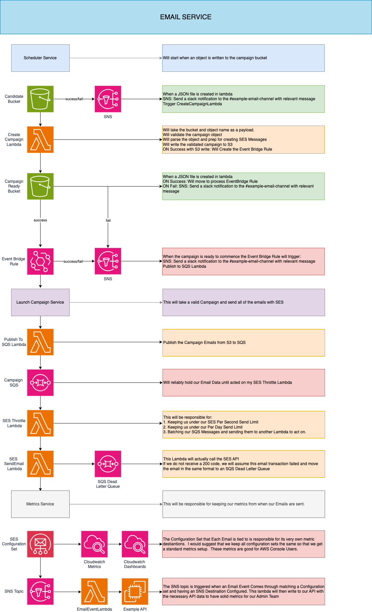

# Example Email Service

Simple systemd design plan to implement sending ~10 million emails a month



## Campaign Anatomy

The goal of this is to take the campaign, lists and metadata from the dev team and transform this data into a format AWS SES can use to send mass email campaigns.

### Campaign Candidate Data Type

This is a basic json representation of the data I am expecting to receive
```jsonc
{
	"campaign_id": "string", // provided by dev team
	"date": "string", // provided by dev team - format to be determined..
	"templateS3Uri": "string", // provided by dev team -  s3 uri of default html template
	"segments": [
		{
			"list_name": "string", // provided by dev team - name of the list
			"templateS3Uri": "string", // provided by dev team or inherited from campaign - s3 uri of html template for segment
			"recipients": [
				{
					"to_address": "string",
					// personalization data, fname, unsub_link, etc...
          // key,value pairs for the given template
					"string": "string"
				}
			]
		}
	]
}
```
### Campaign File

This is an idea of what we should expect to see when the data is verified.

If  we are sending 1 thousand emails, we should have a file with 1 thousand Lines.  

When we scale to say 1M+, it may make sense to break it up into several files with X amount of single line entries. We are not there yet.

```jsonc
{"FromEmailAddress":"from@email.com","Destination":{"ToAddresses":["toAddress@email.com"]},"Content":{"Template":{"TemplateName":"STRING_VALUE","TemplateData":"STRING_VALUE"}},"EmailTags":[{"Name":"campaignId","Value":"some-campaign"},{"Name":"segmentId","Value":"some-list"}],"ConfigurationSetName":"myConfigSet"}
// next rows...
```

Example of what an email object event looks like

```json
{
	"eventType": "Open",
	"mail": {
		"timestamp": "2024-06-20T01:50:12.190Z",
		"source": "sre@example.com",
		"sendingAccountId": "xxaws-accountxxx",
		"messageId": "010f019033564cde-f72f7f27-aee6-44eb-b35b-f501014a6b55-000000",
		"destination": [
			"user3@example.com"
		],
		"headersTruncated": false,
		"headers": [
			{
				"name": "Date",
				"value": "Thu, 20 Jun 2024 01:50:12 +0000"
			},
			{
				"name": "From",
				"value": "sre@example.com"
			},
			{
				"name": "To",
				"value": "user3@example.com"
			},
			{
				"name": "Subject",
				"value": "Hi sre, this is a test email for AWS SES!"
			},
			{
				"name": "MIME-Version",
				"value": "1.0"
			},
			{
				"name": "Content-Type",
				"value": "multipart/alternative;  boundary=\"----=_Part_159887_623208973.1718848212303\""
			}
		],
		"commonHeaders": {
			"from": [
				"sre@example.com"
			],
			"date": "Thu, 20 Jun 2024 01:50:12 +0000",
			"to": [
				"user3@example.com"
			],
			"messageId": "010f019033564cde-f72f7f27-aee6-44eb-b35b-f501014a6b55-000000",
			"subject": "Hi sre, this is a test email for AWS SES!"
		},
		"tags": {
			"ses:source-tls-version": [
				"TLSv1.3"
			],
			"ses:operation": [
				"SendTemplatedEmail"
			],
			"ses:configuration-set": [
				"sre-test-config-set"
			],
			"ses:source-ip": [
				"152.97.185.58"
			],
			"ses:from-domain": [
				"example.com"
			],
			"ses:caller-identity": [
				"user3"
			],
			"list_name": [
				"some_list_name"
			],
			"campaign_id": [
				"some_campaign_id"
			]
		}
	},
	"open": {
		"timestamp": "2024-06-20T01:50:30.377Z",
		"userAgent": "Mozilla/5.0",
		"ipAddress": "104.28.77.146"
	}
}
```

## example Email Service Infrastructure

### Scheduler Service

The responsiblity of the scheduler is to:
1. Create new Campaign
2. Read (List, Describe) Campaigns
3. Update a Campaign Date
4. Delete A Campaign

The scheduler will use the [Campaign Verification](#campaign-verification) first.

Then the scheduler will write a one-time rule in cloudwatch event bridge. 

This rule will invoke [Launch Campaign Lambda](#launch-campaign-lambda) with bucket uri as payload

#### Campaign Verification

This will verify that the date and campaign data are valid inputs for the scheduler service.

This will create a campaign_id

This will create all SES Templates from  html template s3 uris.

This will resolve all defaults
- FromEmailAddress
- ConfigurationSetName
- TemplateName

This will resolve all segment specific data
- FromEmailAddress
- ConfigurationSetName
- TemplateName

This will create a JSON file with an array of SES SendEmail Arguments from campaign data

### Launch Campaign Service

This will start the campaign when a registered campaign has been scheduled with the [Scheduler Service](#scheduler-service).

#### Process
1. Cron Scheduler Event Bridge will run every minute and Trigger a Check for Campaign Lambda
2. Lambda will check if there is an email campaign(or campaigns) scheduled for the cron window.
   1. True
      1. Trigger [Launch Campaign Lambda](#launch-campaign-lambda)
   2. False
      1. Exit

#### Launch Campaign Lambda

This will take the data from the S3 location and publish it to [SQS SES Send Email Queue](#sqs-ses-send-email-queue) in appropriate batches.

### SQS SES Send Email Queue

This will house our send email messages and preserve them in a reliable datastore until they have been sent. 

#### SQS SES Send Email Dead Letter Queue

This will act as grounds to review emails manually or automatically. It will house SES Send Email Requests that fail for whatever reason.

### SES Send Email Throttle Lambda (Not Hooked up)

This lambda will be responsible for throttling our lambdas in 3 dimensions.

1. Concurrency - We shall know to stay under the per second lambda threshold
2. Per Second Email Threshold - We can only send so many emails per second with SES
3. Per Day Email Threshold - Be sure to stay under the per day email threshold.

### SES Send Email Lambda

This will be a function that will take an SQS SES Send Email Message batch and make the appropriate send email call to SES.

In the event of an error a message will be sent to a [Dead Letter Queue](#sqs-ses-send-email-dead-letter-queue)


### SNS SES Event Topic

This event topic is configured by the Configuration Set.  For a given email event, a the SES event Topic will triggered.

We can create an SNS topic for every event type, for all events, or however we see fit.

### SES Publish Event Lambda

This lambda will be invoked from the [SNS SES Event Topic](#sns-ses-event-topic).

This will publish event data from the Email itself to an internal DB.  This can be how our admin team can see metrics for a given campaign.

In the event this fails, we can use a Dead Letter Queue and a redrive policy to try again.

### Cloudwatch Metrics

Like the [SNS SES Event Topic](#sns-ses-event-topic), we can add a cloudwatch destination to the configuration set.  

This will be responsible for making simple dashboards for how each configuration set is performing as a whole. 

For Campaign Specific Metrics we will need an internal tool to view from our email database
